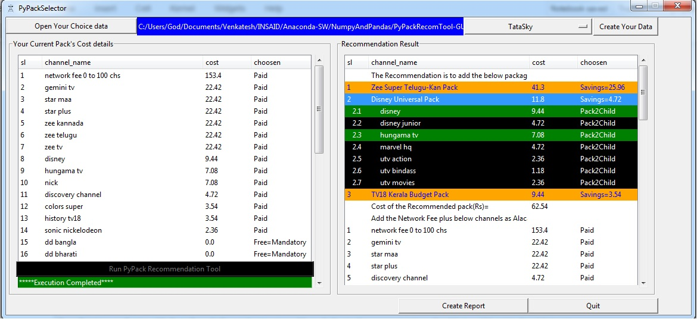

# PyPackRecommendationTool
Pack Recommendation Tool for choosing the best Pack from the list of packs provided by an service provider

  

## INTRODUCTION
The most painful task for any user who wishes to create his own pack is to know the pack which will give him the most cost savings from the list of channels he wishes to watch as the packs offer a better bargain against choosing channels as Alcarte.The PyPackRecommendation tool helps in optimizing the cost of users selection of channels by helping them identify the most cost saving packs from a plethora of packs provided by an service provider. 

## EXCEL DATA FILE
An excel file which contains the users wishlist from the list of all channels.

## PROJECT ANALYSIS
| Description | Analysis |
| --- | --- |
| Red wine  |  |
| White wine |  |

#### Conclusion
##### The PyPackRecommendation Tool provides a means of optimizing the cost when it is presented with a list of channels and in return it offers the user the best pack the service provider has to offer.
.

[Jupyter Notebook](.PyPackRecommendationTool/MyPackRecommendationTool_GUI_Ver7.ipynb)
